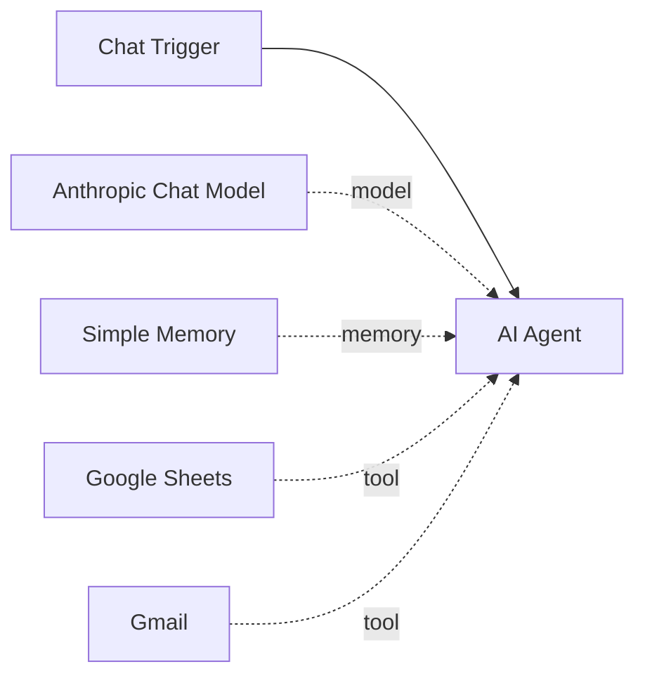

# DataPilot AI


### Conversational spreadsheet analysis and Gmail automation

An evidence-backed **n8n prototype** connecting chat, an Anthropic Chat Model, Google Sheets, Simple Memory, and Gmail.

> **Status: prototype.** Small-sheet interaction and delivery of a static email are demonstrated in supplied screenshots. Large raw-row model input failed. An end-to-end data-derived report and the original sanitized workflow export are still pending.

## What is demonstrated?
| Capability | Evidence and boundary |
|---|---|
| Spreadsheet retrieval | Sheets output shows successful retrieval |
| Small-sheet response | One agent result displays 43 data rows plus a header |
| Email delivery | A received email contains a static greeting, not an analytics report |
| Large-data failure | 20,407 returned items followed by request entity too large |
| Dynamic analytics email | Not yet verified |
| Reproducible workflow import | Blocked until the original workflow JSON is provided |

## Architecture

Connected tools do not necessarily execute on every request. The target redesign calculates counts and aggregates outside the model, then sends a compact validated summary for explanation and an approved email action.

## Start here
- [Project report](docs/PROJECT_REPORT.md): architecture, evidence, setup, tests, privacy, limitations, roadmap, and interview notes.
- [Workflow export requirements](workflows/README.md): original JSON still pending; no fabricated workflow included.
- [Presentation content](presentation/slides.json): twelve-slide narrative with speaker notes.

## PPT, PDF, and Word report
The repository includes the source and build script for editable PPTX, PDF, and DOCX deliverables. The **Build project package** GitHub Actions workflow generates them and uploads a `datapilot-project-package` artifact. Its successful execution must be checked; no hosted build is claimed before it runs.

Open **Actions → Build project package → successful run → Artifacts** to access the generated bundle. Binary files are generated as artifacts, not committed directly to the repository.

To build locally:
```bash
python -m pip install -r requirements.txt
python scripts/validate_fixture.py
python -m unittest discover -s tests -v
python scripts/build_deliverables.py
```

## Tests and maturity
The included eight-row fixture is fictional. Fixture tests check calculations and invalid inputs only; they do not run n8n, the model, Google Sheets, or Gmail. Currency is unspecified. No customer adoption, ROI, accuracy percentage, SLA, deployment claim, or security certification is made.

Original screenshots and raw source data are excluded because they contain personal contacts, private workspace details, or source records. Evidence observations are recorded in the report; images are not public in this repository.

Project owner: [AnyalstRushi](https://github.com/AnyalstRushi). Documentation prepared 7 October 2026. No reuse license has been selected; third-party software retains its own terms.
